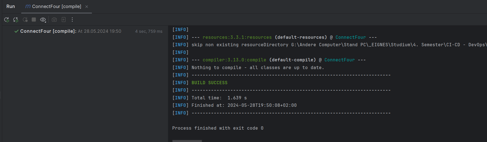

SPW4 - Exercise 3
=================

Name: Daniel Mitterlehner

Effort in hours: 5h

## 1. Connect Four Web Application and CI/CD Pipeline

### Task 1.a

Die Task 1.a haben wir ja schon in der Übung gemacht, hier die Ausgaben:

mvn compile:

mvn test:

mvn package:

mvn tomcat7:run:

### Task 1.b

Die Task 1.b haben wir auch schon in der Übung gemacht:

### Task 1.c

<!--- describe your solution here --->
