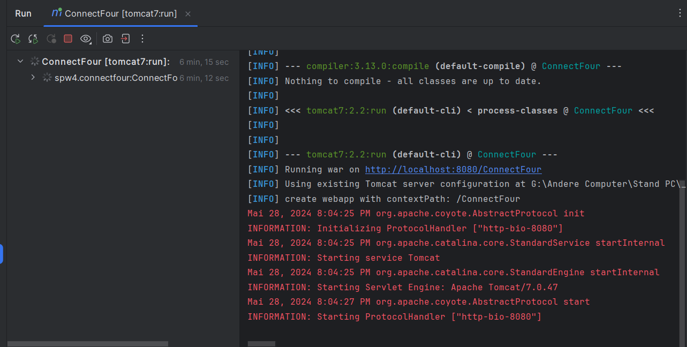

SPW4 - Exercise 3
=================

Name: Daniel Mitterlehner

Effort in hours: 5h

## 1. Connect Four Web Application and CI/CD Pipeline

### Task 1.a

Die Task 1.a haben wir ja schon in der Übung gemacht, hier die Ausgaben:

mvn compile:

mvn test:

mvn package:

mvn tomcat7:run:

### Task 1.b

Die Task 1.b haben wir auch schon in der Übung gemacht. Also die .yml File schreiben mit dem Stages und 
Umgebungsvariablen etc. Den gitlab runner in der WSL starten. Die Übergabe der Artifacts eingerichtet...

### Task 1.c

Ich habe die Schritte ähnlich zur Übung wiederholt. Schauen das die Container laufen. In SonarQube ein neues Project 
für Github erstellt und SONAR_TOKEN / SONAR_URL als Secret bei Github eingetragen.

Dann einen Github runner in der WSL installiert, einen neuen Runner nutzer erstellt der dann den Runner ausführt.

